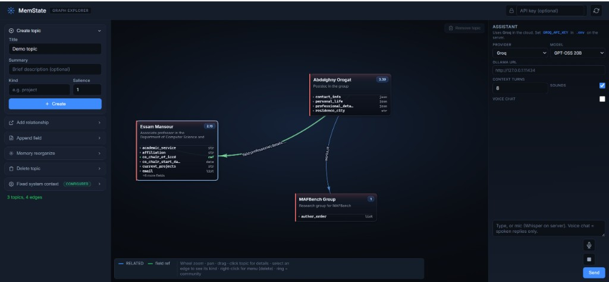

<div align="center">

# MemState

### Long-term topic-graph memory for AI agents

Backed by embedded [Kuzu](https://kuzudb.com/), with a FastAPI ingest/query layer,<br/>
LLM chat (Ollama and Groq), and a D3 graph explorer UI.

[](https://www.python.org/)
[](https://fastapi.tiangolo.com/)
[](https://kuzudb.com/)
[](https://www.docker.com/)
[](https://cods-gcs.github.io/MemState/)

[**Documentation**](https://cods-gcs.github.io/MemState/) &nbsp;&nbsp;|&nbsp;&nbsp; [**Quick Start**](#quick-start) &nbsp;&nbsp;|&nbsp;&nbsp; [**Demo Video**](https://www.youtube.com/watch?v=XPLHPOdUy-g)

</div>

<br/>

<div align="center">
  
  <br/>
  <sub><i>The MemState Graph Explorer — visual topic graph, field editing, and a built-in assistant.</i></sub>
</div>

<br/>

## Contents

- [Overview](#overview)
- [Features](#features)
- [Quick Start](#quick-start)
- [Requirements](#requirements)
- [Docker](#docker)
- [Documentation](#documentation)
- [Project Layout](#project-layout)
- [About](#about)

## Overview

MemState gives AI agents a persistent, structured memory. Observations are stored as a versioned topic graph and retrieved through a small API, so agents can accumulate knowledge over time instead of relying on a fixed context window.

## Features

| Capability | Description |
| --- | --- |
| **Topic graph storage** | Versioned fields, salience, embeddings, and typed `RELATED` links |
| **Agent API** | `POST /v1/ingest` and `POST /v1/query` for observation-shaped memory operations |
| **LLM assistant** | Intent-routed chat with memory tools (Ollama or Groq), plus a two-phase Study pipeline for long documents |
| **Graph Explorer UI** | Visual topic graph, field editing, and a built-in assistant panel |
| **MCP server** | `memstate-llm-mcp` for Model Context Protocol clients |

## Quick Start

```bash
pip install -e .
cp .env.example .env
python -m memstate.api.cli   # or: memstate-api
```

| Resource | URL |
| --- | --- |
| Graph Explorer | `http://127.0.0.1:8765/ui/` |
| Interactive API docs | `http://127.0.0.1:8765/docs` |

## Requirements

- Python 3.11 or later
- Optional: [Ollama](https://ollama.com) for local LLM chat, or a [Groq](https://console.groq.com) API key for cloud chat and speech-to-text

## Docker

```bash
docker compose up
```

See the [Docker guide](docs/guides/docker.md) for persistence and configuration.

## Documentation

### Repository guides

| Guide | Description |
| --- | --- |
| [Quickstart](docs/guides/quickstart.md) | Install, run, UI controls |
| [Data model](docs/guides/data-model.md) | Topics, fields, relationships |
| [Configuration](docs/guides/configuration.md) | Environment variables |
| [API reference](docs/guides/api-reference.md) | Endpoints, request and response shapes |
| [LLM providers and chat](docs/guides/llm-providers.md) | Ollama, Groq, Study pipeline, MCP |
| [Authentication](docs/guides/authentication.md) | API keys and admin access |
| [Docker](docs/guides/docker.md) | Container deployment |


## Project Layout

```
src/memstate/     Core library, API, LLM tools, graph store
docs/             Product documentation (HTML) and repository guides (Markdown)
tests/            Pytest suite
```

## About

MemState is a reference implementation of **Governed Evolving Memory (GEM)**, the framework introduced in our paper. It is a research prototype: a runnable proof-of-concept that demonstrates how the core ideas of GEM work in practice. The system is an early, focused artifact for researchers and developers who want to explore the approach directly, and its design will continue to evolve as the framework is extended beyond this initial reference build.

<div align="center">
<sub>Developed at the <a href="https://cods.encs.concordia.ca/">CoDS Lab</a>, Concordia University.</sub>
</div>