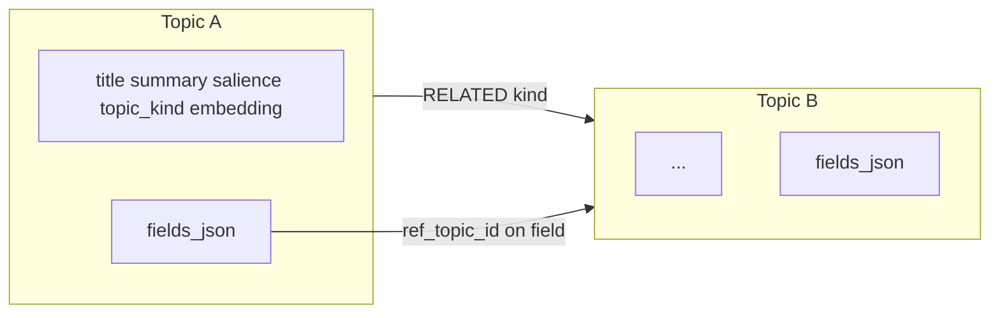

# MemState

**Website (documentation):** [https://aorogat.github.io/MemState/index.html](https://aorogat.github.io/MemState/index.html)

Topic-graph memory backed by an embedded **Kuzu** database. Exposes a FastAPI server for ingest/query, an LLM chat interface (Ollama + Groq), and a D3 graph explorer UI.

## Table of contents

- [Data model](#data-model)
- [Quickstart](#quickstart)
- [Configuration](#configuration)
- [API reference](#api-reference)
  - [Health](#health)
  - [Ingest & query](#ingest--query)
  - [UI / graph](#ui--graph)
  - [Topics](#topics)
  - [Relationships](#relationships)
  - [Fields](#fields)
  - [LLM chat](#llm-chat)
  - [Speech-to-text](#speech-to-text)
- [LLM providers](#llm-providers)
- [Study pipeline](#study-pipeline)
- [Authentication](#authentication)
- [MCP server](#mcp-server)
- [Docker](#docker)

---

## Data model

Each **Topic** node stores scalar metadata (`title`, `summary`, `salience`, `topic_kind`, `embedding`, timestamps) and a JSON blob **`fields_json`** for typed, versioned fields with per-field history and an optional **`ref_topic_id`** (field-level reference to another topic).

**Topic vs entity:** a topic is the unit of storage — one self-contained record on the graph. Informal entities (things you mean) often live *inside* a topic as field values while they stay small and lightly shared. When an entity grows complex, is tied to many topics, or needs its own revision story, split it into a separate topic and link via `RELATED` and/or `ref_topic_id`.

**Topic–topic links** use a **`RELATED`** edge with a typed `kind` string (e.g. `associated_with`, `has_detail`). **Field references** are modelled in the UI graph as edges from a topic to its referenced topic when `ref_topic_id` is set on a field.



---

## Quickstart

```bash
pip install -e .
cp .env.example .env        # edit as needed
python -m memstate.api.cli  # or: memstate-api
```

Open `http://127.0.0.1:8765/ui/` for the graph explorer.

**UI controls:** scroll to zoom · drag background to pan · drag nodes to rearrange · double-click empty SVG to reset zoom.

> **OneDrive / cloud-sync warning:** Kuzu holds an exclusive file lock. Set `MEMSTATE_KUZU_PATH` to a path outside any synced folder (e.g. `%LOCALAPPDATA%\MemState\memstate.kuzu` on Windows) to avoid lock conflicts.

---

## Configuration

All settings use the `MEMSTATE_` prefix and can be set in `.env` or as environment variables. `GROQ_API_KEY` is the only key loaded *without* the prefix (standard convention).

| Variable | Default | Description |
|---|---|---|
| `MEMSTATE_KUZU_PATH` | `memstate.kuzu` | Path to the embedded Kuzu database file. Parent directories are created automatically. |
| `MEMSTATE_API_KEY` | *(none)* | Bearer / X-API-Key required for all protected endpoints. Leave unset to disable auth. |
| `MEMSTATE_ADMIN_KEY` | *(none)* | Stronger key for protected config updates (e.g. system context). Falls back to `MEMSTATE_API_KEY`. |
| `MEMSTATE_API_HOST` | `0.0.0.0` | Bind address for the HTTP server. |
| `MEMSTATE_API_PORT` | `8765` | Bind port for the HTTP server. |
| `MEMSTATE_OLLAMA_BASE_URL` | `http://127.0.0.1:11434` | Ollama API base URL. |
| `MEMSTATE_OLLAMA_MODEL` | `llama3.2:latest` | Default Ollama model for chat. |
| `MEMSTATE_OLLAMA_ALLOW_REMOTE` | `false` | Allow client-supplied Ollama URLs to any host. Disabled by default (SSRF risk). |
| `GROQ_API_KEY` | *(none)* | Groq Cloud API key. Required when `provider=groq`. |
| `MEMSTATE_GROQ_MODEL` | `openai/gpt-oss-20b` | Default Groq model for chat. |
| `MEMSTATE_GROQ_WHISPER_MODEL` | `whisper-large-v3-turbo` | Groq Whisper model for speech-to-text. |
| `MEMSTATE_CHAT_INTENT_TURNS` | `8` | Dialogue turns (1–64) sent to the intent classifier. |
| `MEMSTATE_CHAT_MAX_TOOL_ROUNDS` | `32` | Max LLM↔API tool-call iterations per request (1–256). |
| `MEMSTATE_CHAT_CHUNK_THRESHOLD_CHARS` | `10000` | Character threshold above which the Study pipeline activates for ingest/both intents. |
| `MEMSTATE_CHAT_CHUNK_PER_SEGMENT_TOOL_ROUNDS` | `72` | Tool budget for Study phase A (8–256). |
| `MEMSTATE_STUDY_PHASE_DELAY_SECONDS` | `8.0` | Pause between Study phase A and B to reduce Groq TPM bursts. Set `0` to disable. |
| `MEMSTATE_GROQ_RATE_LIMIT_MAX_RETRIES` | `20` | Max retries on Groq 429 / rate_limit_exceeded (1–100). |
| `MEMSTATE_GROQ_RATE_LIMIT_BACKOFF_CAP_SECONDS` | `120.0` | Cap (seconds) for Groq rate-limit backoff sleep (1–600). |
| `MEMSTATE_QUERY_FIELD_SALIENCE_BUMP` | `0.1` | Salience increase per field read on query intent (0–2). |
| `MEMSTATE_FIELD_SALIENCE_MAX` | `10.0` | Maximum field salience (0.1–10). |

---

## API reference

Interactive docs are available at `http://127.0.0.1:8765/docs`.

All endpoints except `/health`, `/health/graph`, `/health/falkordb`, and `/` require authentication when `MEMSTATE_API_KEY` is set (see [Authentication](#authentication)).

---

### Health

#### `GET /health`

Liveness check. No auth required.

**Response `200`**
```json
{ "status": "ok" }
```

---

#### `GET /health/graph`

Verifies the embedded Kuzu store opens and responds. No auth required.

**Response `200`**
```json
{ "status": "ok", "backend": "kuzu", "path": "memstate.kuzu" }
```

**Response `503`** — store unavailable
```json
{
  "status": "error",
  "error": "...",
  "path": "memstate.kuzu",
  "hint": "..."
}
```

---

#### `GET /health/falkordb`

Backward-compatible alias for `GET /health/graph`.

---

### Ingest & query

#### `POST /v1/ingest`

Ingest structured data into the topic graph. Triggers a background reasoner pass after completion.

**Request body** — `IngestRequest` (see `src/memstate/core/models.py`)

**Response `200`** — `IngestResponse`

---

#### `POST /v1/query`

Query the topic graph. Triggers a background reasoner pass after completion.

**Request body** — `QueryRequest`

**Response `200`** — `QueryResponse`

---

### UI / graph

#### `GET /api/ui/graph`

Returns a graph snapshot (nodes, edges, community IDs) for the D3 visualizer.

**Response `200`**
```json
{
  "nodes": [...],
  "edges": [...]
}
```

---

#### `GET /api/ui/datamodel`

Returns the Mermaid source string for the data-model diagram.

**Response `200`**
```json
{ "mermaid": "flowchart LR\n  ..." }
```

---

#### `GET /api/ui/system-context`

Returns the configured fixed system role / runtime context, if any.

**Response `200`**
```json
{
  "configured": true,
  "system_context": {
    "system_role": "...",
    "runtime_context": "..."
  }
}
```

---

#### `PUT /api/ui/system-context`

Sets or updates the fixed system role and runtime context injected into every LLM prompt. Requires `X-Admin-Key` when a config already exists and `MEMSTATE_ADMIN_KEY` (or `MEMSTATE_API_KEY`) is set.

**Request body**
```json
{
  "system_role": "You are a knowledge assistant.",
  "runtime_context": "Running in a research environment."
}
```

**Response `200`** — same shape as `GET /api/ui/system-context`

---

### Topics

#### `GET /api/ui/topics`

Lists all topic IDs.

| Query param | Type | Default | Description |
|---|---|---|---|
| `include_archived` | `bool` | `false` | Include archived topics. |

**Response `200`**
```json
{ "topic_ids": ["uuid-1", "uuid-2"] }
```

---

#### `POST /api/ui/topics`

Creates a new topic.

**Request body**
```json
{
  "title": "My topic",
  "summary": "Optional summary.",
  "topic_kind": "note",
  "salience": 1.0,
  "topic_id": null
}
```

**Response `200`**
```json
{ "topic_id": "generated-or-supplied-uuid" }
```

---

#### `GET /api/ui/topics/{topic_id}`

Returns full topic data including fields and history.

**Response `200`**
```json
{
  "id": "...",
  "title": "...",
  "summary": "...",
  "topic_kind": "...",
  "salience": 1.0,
  "failed_salience": 0.0,
  "archived": false,
  "fields": {
    "field_name": {
      "field_type": "string",
      "ref_topic_id": null,
      "history": [...]
    }
  },
  "topic_history": [...],
  "created_at": "...",
  "updated_at": "..."
}
```

**Response `404`** — topic not found

---

#### `PATCH /api/ui/topics/{topic_id}`

Partially updates topic metadata. Omit any field to leave it unchanged.

**Request body**
```json
{
  "title": "Updated title",
  "summary": null,
  "topic_kind": null,
  "salience": null,
  "archived": null
}
```

**Response `200`**
```json
{ "topic_id": "..." }
```

---

#### `DELETE /api/ui/topics/{topic_id}`

Deletes a topic and its edges.

**Response `200`**
```json
{ "deleted": "topic-uuid" }
```

---

### Relationships

#### `POST /api/ui/topics/{from_id}/relationships`

Adds a typed `RELATED` edge between two topics.

**Request body**
```json
{
  "to_topic_id": "target-uuid",
  "kind": "associated_with"
}
```

**Response `200`**
```json
{ "ok": "true" }
```

---

#### `DELETE /api/ui/topics/{from_id}/relationships`

Removes a `RELATED` edge.

| Query param | Required | Description |
|---|---|---|
| `to_topic_id` | yes | Target topic ID. |
| `kind` | yes | Edge kind string. |

**Response `200`**
```json
{ "ok": "true" }
```

---

### Fields

Fields live inside a topic's `fields_json` blob. Each field has a type, an optional `ref_topic_id`, and an append-only history log.

#### `POST /api/ui/topics/{topic_id}/fields`

Appends a new history entry to a field (creates the field if it does not exist).

**Request body**
```json
{
  "field_name": "status",
  "value": "active",
  "field_type": "string",
  "ref_topic_id": null,
  "why_changed": "Initial value",
  "impact_expected": null,
  "provenance": "ui",
  "max_history": 500
}
```

**Response `200`**
```json
{ "version_id": "uuid" }
```

---

#### `GET /api/ui/topics/{topic_id}/fields/{field_name}`

Returns a field's current type, reference, and history.

| Query param | Type | Default | Description |
|---|---|---|---|
| `with_history` | `bool` | `true` | Include full history entries. |

**Response `200`**
```json
{
  "field_type": "string",
  "ref_topic_id": null,
  "history": [...]
}
```

---

#### `DELETE /api/ui/topics/{topic_id}/fields/{field_name}`

Removes a field and its history from the topic.

**Response `200`**
```json
{ "deleted": "field_name" }
```

---

#### `PUT /api/ui/topics/{topic_id}/fields/{field_name}/ref`

Sets or clears the `ref_topic_id` on a field without appending a new history entry.

**Request body**
```json
{ "ref_topic_id": "target-uuid-or-null" }
```

**Response `200`**
```json
{ "ok": "true" }
```

---

#### `POST /api/ui/topics/{topic_id}/promote-nested`

Moves a set of fields out of a topic into a new child topic, adds a `RELATED` edge, and optionally creates a back-reference field on the parent.

**Request body**
```json
{
  "field_names": ["field_a", "field_b"],
  "child_title": "Child topic title",
  "child_summary": null,
  "child_topic_id": null,
  "relationship_kind": "has_detail",
  "parent_link_field": null,
  "max_history": 500
}
```

**Response `200`**
```json
{ "ok": true, "child_topic_id": "...", "moved_fields": [...] }
```

---

#### `POST /api/ui/topics/{topic_id}/undo-nested`

Reverses a `promote-nested` operation — moves the child's fields back into the parent and removes the edge.

**Request body**
```json
{
  "child_topic_id": "child-uuid",
  "relationship_kind": null
}
```

**Response `200`**
```json
{ "ok": true, ... }
```

---

#### `POST /api/ui/topics/{topic_id}/nest-fields`

Groups existing fields under a nested key within `fields_json`.

**Request body**
```json
{
  "field_names": ["field_a", "field_b"],
  "nest_key": "group_name",
  "provenance": "ui"
}
```

**Response `200`**
```json
{ "ok": true, ... }
```

---

#### `POST /api/ui/topics/{topic_id}/unnest-fields`

Flattens a nested field group back to the top level.

**Request body**
```json
{ "nest_key": "group_name" }
```

**Response `200`**
```json
{ "ok": true, ... }
```

---

### LLM chat

#### `POST /api/llm/chat`

Sends a dialogue to an LLM (Ollama or Groq) with full access to MemState memory tools. The server classifies intent (`query`, `ingest`, or `both`) and selects the appropriate tool set. Long ingest messages automatically use the [Study pipeline](#study-pipeline).

**Request body**
```json
{
  "messages": [
    { "role": "user", "content": "Remember that the project deadline is June 1." }
  ],
  "provider": "ollama",
  "model": null,
  "ollama_base_url": null,
  "intent_turns": null,
  "intent_override": null,
  "max_tool_rounds": null,
  "study_ingest": true
}
```

| Field | Type | Default | Description |
|---|---|---|---|
| `messages` | `list` | required | Chat thread; last message must be `user`. |
| `provider` | `"ollama"` \| `"groq"` | `"ollama"` | LLM provider. |
| `model` | `string \| null` | provider default | Model ID override. |
| `ollama_base_url` | `string \| null` | server default | Ollama base URL override (requires `MEMSTATE_OLLAMA_ALLOW_REMOTE=true` for non-localhost). |
| `intent_turns` | `int \| null` | `MEMSTATE_CHAT_INTENT_TURNS` | Dialogue turns for intent classification (1–64). |
| `intent_override` | `"query" \| "ingest" \| "both" \| null` | — | Skip classification and fix the intent route. |
| `max_tool_rounds` | `int \| null` | `MEMSTATE_CHAT_MAX_TOOL_ROUNDS` | Max tool-call iterations (1–256). |
| `study_ingest` | `bool` | `true` | Use the Study pipeline for long ingest messages. |

**Response `200`**
```json
{
  "reply": "Done. I stored the deadline under...",
  "tool_log": [...],
  "model": "llama3.2:latest",
  "provider": "ollama",
  "intent": "ingest",
  "intent_source": "classifier",
  "max_tool_rounds": 32
}
```

Study responses additionally include `study_ingest`, `study_session_kind`, and `study_phases`.

**Error responses**

| Code | Condition |
|---|---|
| `400` | Invalid request (empty messages, last message not `user`). |
| `502` | Upstream LLM returned an error. |
| `503` | Cannot reach Ollama or Groq (missing key, network error). |

---

### Speech-to-text

#### `POST /api/llm/transcribe`
#### `POST /api/ui/transcribe`

Both endpoints are identical. Transcribes uploaded audio via Groq Whisper. Requires `GROQ_API_KEY` regardless of chat provider.

**Request** — multipart form upload, field name `audio`. Accepts `webm`, `wav`, `mp3`, `m4a`, and other formats supported by Whisper.

**Response `200`**
```json
{ "text": "Transcribed text here." }
```

---

## LLM providers

### Ollama (default)

Runs locally. [Install Ollama](https://ollama.com), then:

```bash
ollama pull llama3.2      # recommended for tool use
ollama serve              # starts on :11434
```

Set `MEMSTATE_OLLAMA_MODEL` to switch models. Tool-capable models work best (e.g. `llama3.2`, `qwen2.5`, `mistral`).

### Groq

Set `GROQ_API_KEY` in `.env`. Groq is invoked when `provider=groq` is passed to `/api/llm/chat`. The default model is `openai/gpt-oss-20b`; override with `MEMSTATE_GROQ_MODEL`.

Groq rate limits are handled automatically with configurable backoff retries (`MEMSTATE_GROQ_RATE_LIMIT_MAX_RETRIES`, `MEMSTATE_GROQ_RATE_LIMIT_BACKOFF_CAP_SECONDS`).

---

## Study pipeline

When a chat message's last user turn exceeds `MEMSTATE_CHAT_CHUNK_THRESHOLD_CHARS` characters and the intent is `ingest` or `both`, MemState runs a two-phase Study pipeline instead of a single LLM call:

1. **Phase A — sandbox:** builds a structural hierarchy of the document, then runs an ingest pass using a `study:<session_id>` topic kind. All new topics are scoped to the session.
2. **Phase B — integrate:** links Study topics into the existing memory graph, merges duplicates, and updates `topic_kind` when appropriate.

A configurable delay (`MEMSTATE_STUDY_PHASE_DELAY_SECONDS`) between phases reduces Groq TPM bursts. Set `study_ingest=false` in the request body to force a single-call flow.

---

## Authentication

When `MEMSTATE_API_KEY` is set, all endpoints except `/`, `/health`, `/health/graph`, and `/health/falkordb` require authentication.

Send the key using either:

- `X-API-Key: <key>` header
- `Authorization: Bearer <key>` header

`MEMSTATE_ADMIN_KEY` provides a separate, stronger key for write operations on system configuration (`PUT /api/ui/system-context`). If `MEMSTATE_ADMIN_KEY` is not set, `MEMSTATE_API_KEY` is used for admin checks as well.

---

## MCP server

MemState exposes an MCP (Model Context Protocol) server for integration with MCP-compatible clients:

```bash
memstate-llm-mcp
```

---

## Docker

```bash
docker compose up
```

The default `docker-compose.yml` builds and starts the API on port `8765`. Mount a volume or set `MEMSTATE_KUZU_PATH` to persist the database outside the container.
