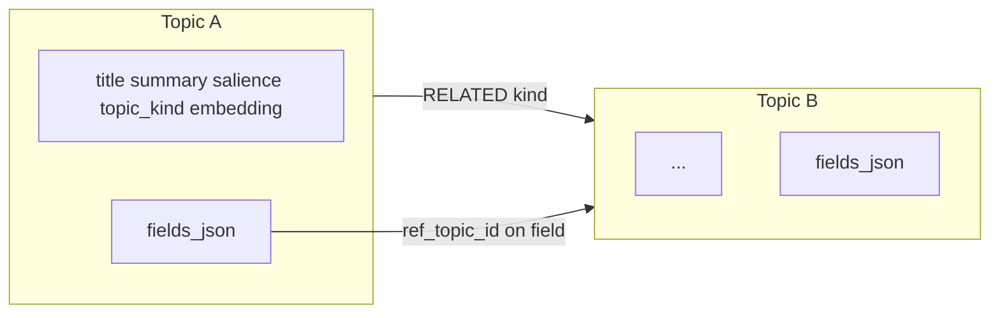

# Data model

Each **Topic** node stores scalar metadata (`title`, `summary`, `salience`, `topic_kind`, `embedding`, timestamps) and a JSON blob **`fields_json`** for typed, versioned fields with per-field history and an optional **`ref_topic_id`** (field-level reference to another topic).

**Topic vs entity:** a topic is the unit of storage — one self-contained record on the graph. Informal entities (things you mean) often live *inside* a topic as field values while they stay small and lightly shared. When an entity grows complex, is tied to many topics, or needs its own revision story, split it into a separate topic and link via `RELATED` and/or `ref_topic_id`.

**Topic–topic links** use a **`RELATED`** edge with a typed `kind` string (e.g. `associated_with`, `has_detail`). **Field references** are modelled in the UI graph as edges from a topic to its referenced topic when `ref_topic_id` is set on a field.

## Further reading

- [Data model overview (HTML)](../data-model/overview.html) — content, structure, policies
- [Fields and history (HTML)](../data-model/fields.html)
- [Relationships (HTML)](../data-model/relationships.html)
- [Limits and configuration (HTML)](../data-model/limits-and-config.html)
